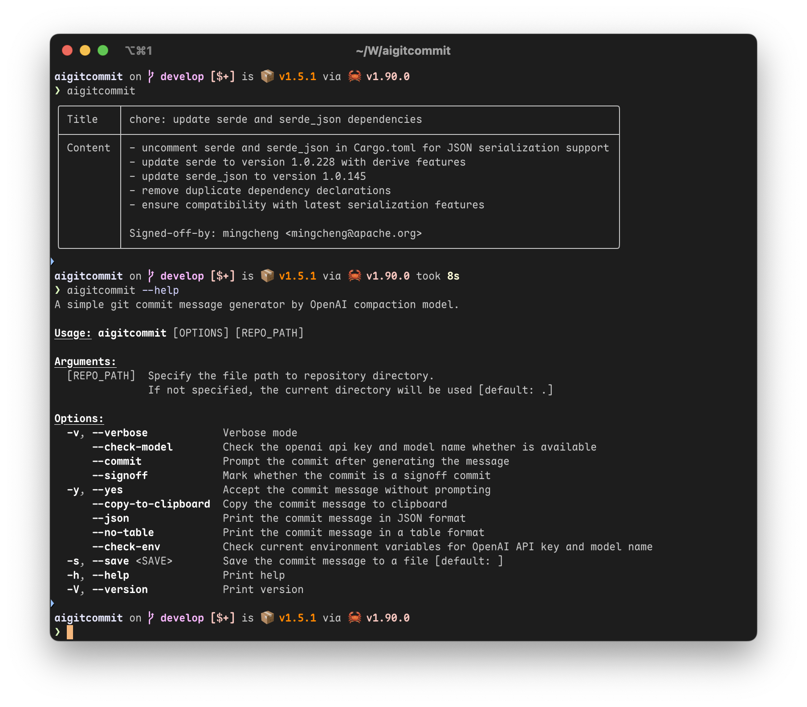

# AIGitCommit

[](https://github.com/mingcheng/aigitcommit/actions/workflows/rust.yml)



A simple tool to help you write Git semantic commit messages by using AI.

## References

- https://www.conventionalcommits.org/en/v1.0.0/
- https://nitayneeman.com/blog/understanding-semantic-commit-messages-using-git-and-angular/
- https://ssshooter.com/2020-09-30-commit-message/

## Features

- Generates meaningful commit messages based on your code changes
- It allows you to commit straight to the repository and integrate with the Git workflow.
- The created message can be copied to the clipboard.
- Easy-to-use command-line interface
- By using the libgit2 library, there is no need to call an external command for security reasons
- The system supports multiple AI models that are compatible with the OpenAI API
- Auto sign-off commit messages, if specified environment is set to `true`
- Socks5 and HTTP proxy supported

## How It Works

AIGitCommit looks at your Git staged changes and uses AI to make commit lines that are clear and helpful.

It looks at the diff result and uses machine learning to figure out what your changes were meant to do and why you made them. It then generates a commit message that is clear and helpful.

## Install

AIGitCommit is still in the early stages of development, I suggest you to install it using the git URL using the commands below:

```
cargo install --git https://github.com/mingcheng/aigitcommit.git
```

or, You can install from [crates.io](https://crates.io/crates/aigitcommit)

```
cargo install aigitcommit
```

Those command will auto-download the latest version of the project and install it to your cargo bin directory.

## Configuration

Initially, you must configure your `OPENAI_*` environment variables to request prompts from an OpenAI-compatible API service. Set them as follows in your shell configuration file:

- `OPENAI_API_TOKEN`: Your individual OpenAI token
- `OPENAI_API_BASE`: Your specified openAI request base
- `OPENAI_MODEL_NAME`: Give the model name you wish to request
- `OPENAI_API_PROXY`: The proxy address if you need to use a proxy
- `GIT_AUTO_SIGNOFF`: If you want to sign off your commit messages, set this variable to `true`

If your network requirements a proxy to access the API service, you must specify the proxy address using the `OPENAI_API_PROXY` environment variable.

For instance, `http://127.0.0.1:1080` is suitable for an HTTP proxy, while `socks://127.0.0.1:1086` is an appropriate choice for a Socks5 proxy.

## Usage

The way to use AIGitComment is really simple. For example, you can run `aigitcoment` in the current directory after staging the file to have git commits generated automatically before git commit. Additionally, you may provide the git directory using `aigitcommit <dir>`.

1. You can use `--commit` parameters to commit the changes straight to the repository.
2. Or you may just copy the commit message to the clipboard by using `--copy`.

If you would like more usage settings, just use `aigitcommit --help` to get more details.

### Docker Image

You can also utilise the Docker image without installing the binary executable file.

Simply enter the subsequent command or reference the `compose.yaml` file.

```bash
docker run \
  --rm \
  -v $PWD:/repo:ro \
  -e OPENAI_API_BASE='<api base>' \
  -e OPENAI_API_TOKEN='<api token>' \
  -e OPENAI_MODEL_NAME='<model name>' \
  -e OPENAI_API_PROXY='<the proxy address if you need>' \
  ghcr.io/mingcheng/aigitcommit
```

Notice: If you wish to utilise the `--commit` option, you must ensure that the `/repo` directory is writable:

```bash
docker run \
  --rm \
  -it \
  -v $PWD:/repo:rw \
  -e OPENAI_API_BASE='<api base>' \
  -e OPENAI_API_TOKEN='<api token>' \
  -e OPENAI_MODEL_NAME='<model name>' \
  -e OPENAI_API_PROXY='<the proxy address if you need>' \
  ghcr.io/mingcheng/aigitcommit --commit
```

Tips: You can add `--yes` options to skip the confirm.

### Git Hook

The `AIGitCommit` also supports git hooks. To integrate the hook, simply copy the `hooks/prepare-commit-msg` file into the repository's `.git/hooks/prepare-commit-msg`, and you're done.

You can make it global by using Git's `core.hooksPath` instead of setting it up per repository.

```
# Create global hooks directory
mkdir -p ~/.git-hooks

# Copy the script contents above into this file
vim ~/.git-hooks/prepare-commit-msg  # Or use your preferred editor

# Make the script executable
chmod +x ~/.git-hooks/prepare-commit-msg

# Configure Git to use global hooks
git config --global core.hooksPath ~/.git-hooks
```

Now every repository automatically gets `AIGitCommit` commit messages, just use `git commit` command.


## Contributing

Contributions are welcome! Please feel free to submit a Pull Request.

## License

This project is licensed under the MIT License - see the LICENSE file for details.

`- eof -`
